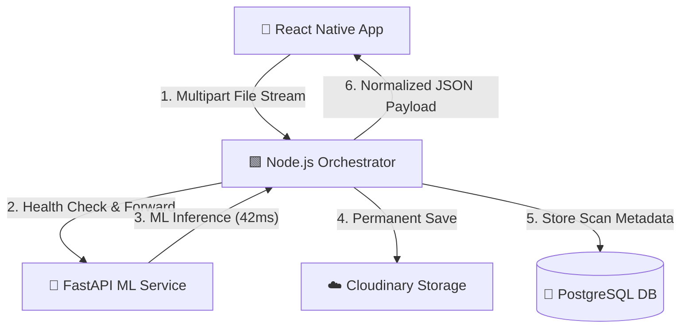

# 🌱 AgroMind AI

<div align="center">
  
</div>

<p align="center">
  <strong>A production-ready, full-stack application leveraging deep learning to detect, diagnose, and provide treatment recommendations for crop diseases.</strong>
</p>

<div align="center">
  <a href="https://reactnative.dev/"></a>
  <a href="https://nodejs.org/"></a>
  <a href="https://fastapi.tiangolo.com/"></a>
  <a href="https://www.tensorflow.org/"></a>
  <a href="https://www.prisma.io/"></a>
  <br>
  
  
  <a href="CONTRIBUTING.md"></a>
</div>

---

## 📱 Visuals & Demo

### Application Walkthrough
*(Upload `demo.gif` to `docs/assets/` and uncomment below)*  
<!--  -->

### Interface Previews
*(Upload screenshots to `docs/assets/` and uncomment below)*  
<!--
| Image Selection | Upload & Analysis | Results Screen |
| :---: | :---: | :---: |
|  |  |  |
-->

---

## ✨ Key Features & Engineering Highlights
- **High-Accuracy ML Pipeline**: Built and fine-tuned a custom TensorFlow MobileNetV2 architecture achieving **98.35% validation accuracy** on target testing datasets.
- **Fail-Fast Upload Orchestration**: The Node.js backend intelligently routes image buffers to the AI service *before* permanent cloud storage. If the AI rejects the image, the upload is aborted, drastically cutting Cloudinary storage costs.
- **Microservice Architecture**: Decoupled the machine learning inference (FastAPI) from the application logic (Node.js) to allow independent scaling of the computationally expensive AI workloads.
- **Resilient Mobile UX**: The React Native frontend features dynamic upload progress tracking, a 70% low-confidence warning guardrail, and graceful retry loops for unstable farm networks.

---

## 🏗️ Architecture



---

## 🧠 The AI Engineering Journey

Building the core AI engine involved overcoming significant challenges:
1. **The Double-Normalization Bug**: Early models plateaued at 33% accuracy. I identified that `image_dataset_from_directory` loaded images at `[0,255]`, but a manual preprocessing step divided them by `255.0` *before* hitting the MobileNetV2 `Rescaling` layer. Removing the manual step instantly fixed feature extraction!
2. **Transfer Learning Optimization**: I froze the BatchNormalization layers to preserve ImageNet statistics and implemented a streamlined classification head (Dense 128) to combat overfitting on the small agricultural dataset.

For a full breakdown of the model, see [AI Model Documentation](docs/AI_MODEL.md).

---

## 🚀 Environment Setup & Installation

### 1. Backend Orchestrator (Node.js)
```bash
cd server
npm install
cp .env.example .env
# Edit .env with your PostgreSQL and Cloudinary credentials

npx prisma migrate dev
npm run dev # Starts on port 5000
```

### 2. AI Inference Service (FastAPI)
*Note: Do not commit large `.keras` models. Download our pre-trained model from [GitHub Releases/HuggingFace] and place it in `ai-service/models/`.*
```bash
cd ai-service
python -m venv venv
# Windows: venv\Scripts\activate | Mac/Linux: source venv/bin/activate
pip install -r requirements.txt
cp .env.example .env

python main.py # Starts on port 8000
```

### 3. Mobile Frontend (React Native)
```bash
cd mobile
npm install
cp .env.example .env
# Set EXPO_PUBLIC_API_URL to your machine's local IP (e.g., http://192.168.1.100:5000/api/v1)

npx expo start
```

---

## 📚 Deep-Dive Documentation
Detailed technical documentation can be found in the `docs/` directory:
- [System Design](docs/SYSTEM_DESIGN.md) - Deep dive into the orchestrator and microservice layout.
- [Architecture Decisions](docs/ARCHITECTURE_DECISIONS.md) - Why FastAPI? Why Fail-Fast? Why Prisma?
- [Deployment Guide](docs/DEPLOYMENT.md) - Step-by-step production hosting.
- [API Reference](docs/API_REFERENCE.md) - REST API endpoints and schemas.

---

## 🗺️ Future Roadmap
- [ ] **Offline Inference**: We are currently retaining `inferenceService.js` to implement `.tflite` offline inference, enabling zero-latency detection without cell service.
- [ ] **Live Camera View**: Real-time bounding box disease detection using YOLOv8.
- [ ] **Multilingual Support**: Extending the UI and disease descriptions into regional languages.
- [ ] **Community Platform**: Allowing farmers to share scans and localized remedies.

---

## 🤝 Contributing
We welcome contributions! Please see our [Contributing Guide](CONTRIBUTING.md) and [Code of Conduct](CODE_OF_CONDUCT.md).

## 📄 License
This project is licensed under the [MIT License](LICENSE).
